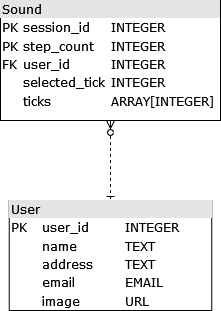

# user_sound_api

Simple User-Sound API

## Basic Design

This is a pretty straight forward DB model, with 2 tables:



A postman collection can be found in the resources folder to make testing easier.

This app was developed to run in GCP Cloud Run + Cloud SQL (Postgres).
Make sure the Cloud SQL is configured properly.

## Running Locally

Remember to create the `venv` and install the depencies in `requirements.txt`:

```
python -m venv venv
pip install -r requirements.txt
source venv/bin/activate
```

This requires docker, make sure you have it installed and configured properly.
Use the file `sample.env` and create a file `.env` with the database variables.
The passwords used are in the docker-compose file, so this is what the file will look like:

```
DATABASE_URL=localhost:15432
DATABASE_LOGIN=admin
DATABASE_PASSWORD=password
DATABASE_NAME=user_sound
PGADMIN_MAIL=admin@test.com
ENV=debug
```

Start the `dev.docker-compose.yml` which will create the postgres and pgadmin containers:

```
docker-compose -f dev.docker-compose.yml up
```

You will need to create the tables in the DB before starting to use the app.
This can be done running the script `create_tables.py` in the scripts folder.
Add the root folder to pythonpath and run the script:

```
export PYTHONPATH=$PYTHONPATH:{your_folder_location}
python scripts/create_tables.py
```

Then run the fastapi app with uvicorn:

```
python -m uvicorn user_sound.main:app
```

The application should start on port 8000.

## Running Unittests

```
export PYTHONPATH=$PYTHONPATH:{your_folder_location}
python -m unittest discover tests.unit
```

## Running Integration Tests

This requires all the ENV listed in the sample.env plus a `HOST_URL`, which has the base URL.
For example, running on docker exposing the port 8000, the env would be:

```
export HOST_URL=http://localhost:8000
```

It is possible to test this by starting `docker-compose.yml` and running:

```
export PYTHONPATH=$PYTHONPATH:{your_folder_location}
python tests/integration/run_tests.py
```

## Deploying Docker Image to GCP

Make sure to have the service account JSON in the `secrets` folder, named as `service-account.json`.

You can run the script `deploy_gcp_cloud_run.sh` located in the scripts folder. Remember to set the env variable `PROJECT_ID` to your google project.
You also must have the

## Points to improve

- Pagination for the List methods.
- Add more edge cases in the tests.
- Creation of separate service accounts for deployment and execution.
- CICD scripts for automatic deployment, merging only when tests pass, etc.
- integration with code quality tools like SonarQube.

## TODO

- [x] Documentation
- [x] User API
- [x] Sound API
- [x] Database
- [x] Unit tests - User
- [x] Unit tests - Sound
- [x] Deployment Script for GCP
- [x] Integration tests - Database
